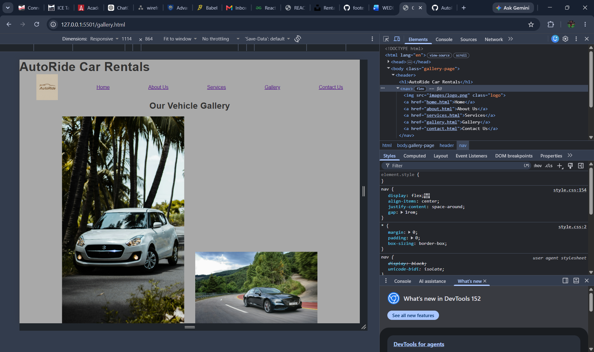
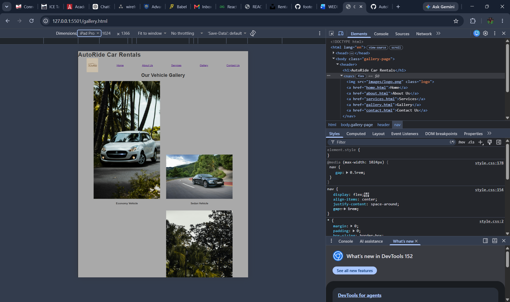
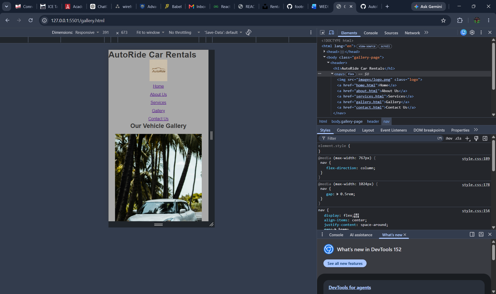

# Autoride car rentals

Proposal :
in document folder

Sitemap:
in document folder

## refrences:

W3Schools Online Web Tutorials : for the languages used
Car hire in Gauteng from R 262/day | Skyscanner : for an idea of my buisness
Beautiful Free Images & Pictures | Unsplash : for images used in website
YouTube : for videos of how to do a proposal and for video used in website
chatGPT : to learn css concepts and fast questions and answers on css topics to optimise time management

## Changelog

Part 1 completed

no additions made to the part 1 work
removed inline css to utilise css file

implemented CSS file
part 2 completed

## Media Queries

### Desktop

### Tablet

### Mobile

## notes

Use srcset for resizable images on diffrent size devices

srcset="images/economy-small.jpg 480w,
images/economy-medium.jpg 800w,
images/economy-large.jpg 1200w"

sizes="(max-width: 767px) 100vw,
(max-width: 1024px) 50vw,
400px"
